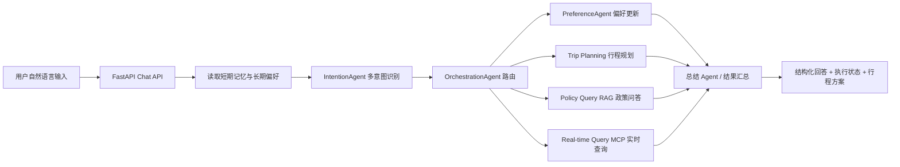
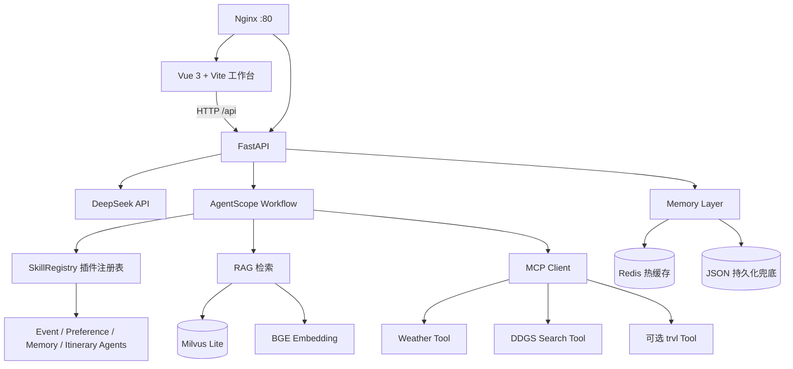
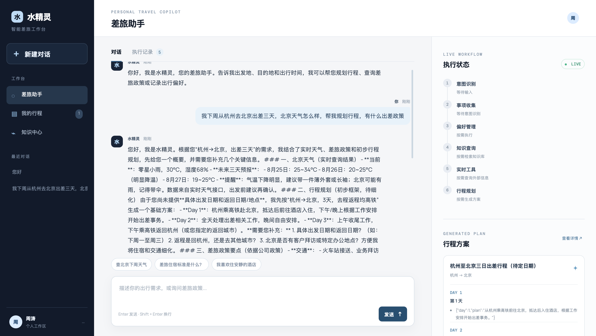
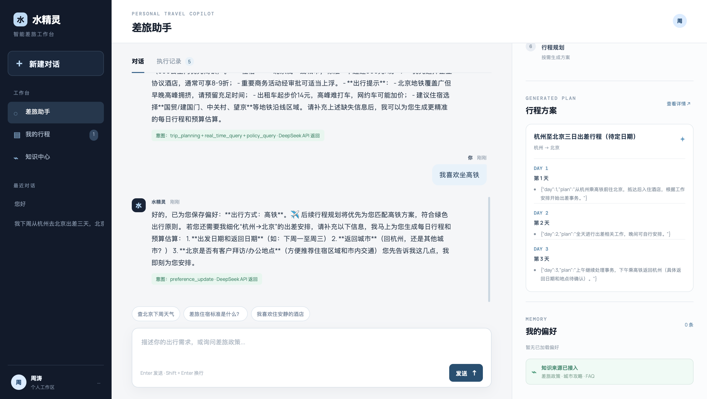

# 水精灵 · 企业差旅 Agent

一个面向企业差旅场景的多 Agent 助手。用户可以通过自然语言完成行程规划、差旅政策问答、出行偏好管理、实时信息查询和知识库检索，并在工作台中查看 Agent 执行状态、工具调用和生成的行程。

> 在线演示：[http://49.232.102.102](http://49.232.102.102)  
> 演示环境默认关闭 `trvl` MCP；天气、搜索、RAG 和基础对话可独立演示。

## 项目背景

传统差旅规划需要用户在多个平台之间切换查询政策、交通、酒店和城市信息。早期版本主要依赖串行调度和关键词匹配，存在意图识别不稳定、上下文记忆不足、实时数据参数不完整以及输出不够结构化等问题。

本项目从产品流程和 Agent 工程两个角度重构了差旅助手：用 LLM 做语义意图识别，用 Skill 插件承载业务能力，用 RAG 连接企业差旅知识，用 MCP 统一外部工具调用，并通过短期记忆、长期摘要和 Redis 缓存实现连续对话。

## 我的角色

- 负责差旅助手的产品流程拆解、核心功能设计和交互工作台设计。
- 负责多 Agent 业务流程、意图路由、优先级与并行调度方案的落地。
- 负责 RAG、Memory、Redis、Skill Plugin、MCP 工具链的集成与验证。
- 负责前后端联调、部署、测试用例设计和演示环境搭建。

## 核心功能

| 模块 | 能力 |
| --- | --- |
| 差旅对话 | 自然语言输入出发地、目的地、日期、预算和偏好 |
| 多意图识别 | 支持行程规划、政策查询、实时查询、偏好更新、记忆查询、普通对话 |
| Agent 调度 | 优先级 + 同组并行，减少互不依赖任务的等待 |
| 两层记忆 | 短期对话上下文 + 长期偏好摘要，Redis 作为热数据缓存 |
| RAG 知识库 | 企业差旅政策、报销规则、预订指南、FAQ 和城市攻略 |
| MCP 工具 | 天气、网页搜索及可选的旅行工具服务 |
| Skill Plugin | Skill 元数据动态发现、按需加载和统一路由 |
| 工作台 | 最近对话、行程保存、知识中心、执行记录和工具调用可视化 |

## 产品流程



## 系统架构



## 关键设计

### 1. 优先级 + 并行调度

偏好更新必须先落盘，因为后续行程规划需要读取最新偏好；政策检索、实时查询和部分只读任务放在同一阶段，通过 `asyncio.gather` 并行执行。接口会返回 `_orchestration` 执行信息，便于调试和评测。

### 2. 两层记忆

- 短期记忆：保存当前 session 最近对话，并在下一轮显式注入上下文。
- 长期记忆：通过后台 LLM 总结提取稳定偏好，避免把一次性行程永久保存。
- Redis：保存偏好和短期消息热数据；Redis 不可用时回退到本地 JSON。

### 3. RAG 知识库

知识文档位于 `data/documents/`。索引使用 Milvus Lite，本地 Embedding 模型使用 `data/models/` 中的 BGE-small（模型权重不提交到公开仓库）。政策 Agent 只基于检索结果回答，回答中保留知识来源提示，降低无依据编造。

### 4. Skill Plugin 与 MCP

Skill 是业务能力的可插拔单元，负责描述意图、指令和处理器；MCP 是外部工具的标准化连接协议。两者分别解决“业务能力如何组织”和“外部工具如何调用”这两个问题。

## 页面截图

### 差旅工作台



### 行程、记忆与执行状态



## 项目结果与测试数据

本项目进行了小规模功能评测，完整记录见 [`tests/results/small_eval_20260822.md`](tests/results/small_eval_20260822.md)。本轮结果如下：

| 指标 | 样本 | 结果 |
| --- | ---: | ---: |
| 意图识别 | 5 | 5/5 |
| RAG 关键事实问答 | 3 | 3/3 |
| 偏好抽取 | 3 | 3/3 |
| Redis 热缓存读取 | 10 | 10/10 |
| 混合调度 | 1 场景 | 串行 14.15 秒，并行 8.51 秒，下降约 39.9% |

这些是小样本工程验证结果，不等同于大规模线上准确率。没有把“90%+ 意图准确率、95% RAG 准确率”等长期指标作为本项目已证明的结论。

## 技术栈

- 前端：Vue 3、Vite、CSS
- 后端：Python、FastAPI、Uvicorn
- 模型：DeepSeek API、BGE Embedding
- Agent：AgentScope、异步 Agent、优先级与并行调度
- 知识库：Milvus Lite、滑动窗口切分、向量检索
- 记忆：Redis、JSON fallback、异步 LLM 摘要
- 工具：MCP、DDGS、天气工具、可选 trvl
- 部署：Ubuntu、Nginx、systemd、腾讯云轻量服务器

## 本地运行

### 1. 配置 API Key

```bash
cp server/.env.example server/.env
```

编辑 `server/.env`，填写：

```env
DEEPSEEK_API_KEY=你的Key
DEEPSEEK_MODEL=deepseek-v4-flash
REDIS_ENABLED=true
REDIS_URL=redis://localhost:6379/0
ENABLE_TRVL_MCP=false
```

不要将 `server/.env` 提交到 GitHub。

### 2. 启动后端

```bash
python3 -m venv .venv
source .venv/bin/activate
pip install -r server/requirements.txt
uvicorn server.main:app --reload --port 8000
```

### 3. 启动前端

```bash
npm install
npm run dev
```

打开 Vite 输出的本地地址，通常是 `http://localhost:5173`。

如需本地启用 RAG，需准备 `BAAI/bge-small-zh-v1.5` 到 `data/models/bge-small-zh-v1.5/`，然后执行：

```bash
python server/rag_index.py
```

### 4. 测试

```bash
pytest -q
npm run build
```

## 服务器部署

Ubuntu、Nginx、Redis、systemd 配置见 [`DEPLOY.md`](DEPLOY.md)。生产环境中 API Key 只配置在服务器端，不放入前端或公开仓库。

## 目录结构

```text
src/                         Vue 页面与样式
server/main.py               FastAPI API 与主路由
server/agentscope_workflow.py AgentScope 工作流、意图与 RAG
server/skill_registry.py     Skill 动态发现与懒加载
server/skills/               可插拔 Skill
server/memory.py             Redis + JSON 两层记忆
server/mcp_client.py         MCP Client
server/mcp_server.py         天气、搜索等工具服务
data/documents/              RAG 原始知识文档
tests/                       单元测试与小规模评测
deploy/                      Nginx 与 systemd 配置
docs/screenshots/            页面截图
```
